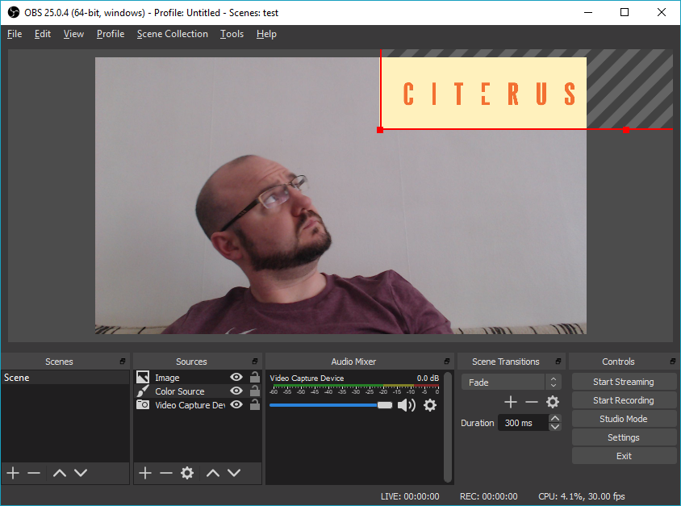

# Open Broadcaster Software for fun and profit

Remote workshops and meetings are very popular right now. However, many of the popular video-conferanceing software alternatives are quite limited in what they can do with streaming video. I've found it useful to use OBS to control my web camera during video meetings.

## a quick tutorial

Download and install [OBS](https://obsproject.com/download) and the [VirtualCamera plugin](https://obsproject.com/forum/resources/obs-virtualcam.949/). Open OBS and select `Tools > VirtualCam` and press `Start`. This should create a virtual web camera (named `OBS-Camera` by default) that you can select in Hangouts, slack, or whatever your choice of video conferance software is.

The main parts of OBS to keep track of are the list of scenes, the list of sources, and the main preview window. Ignore audio mixer in the middle, and the buttons on the right side of the OBS window, they don't help you at the moment.

Scenes contain sources, and sources are what you see in the preview. The preview is also what is sent to the virtual cam. If you just opened OBS for the first time, there will be one Scene (named Scene) with nothing in it, and the preview will be black.

Sources can be images, videos, web pages, text, and, perhaps most important, Video Capture Devices, aka your web camera.

Let's add a web camera source now. Click the plus sign under the sources list, select `Video Capture Device` and click OK in the pop-up. This should automatically open the properties window for your web camera. If you have multiple cameras, or if you're not getting the quality you expect, you can fiddle with these options, otherwise just click OK.

Now you can click and drag your camera source in the preview window to place it where you want it. If you want it to cover the entire screen you can right click the source and select `Transform > Fit to Screen`

You can now open your video conferance software and use the OBS camera, and no one will be the wiser.

## now what?

I can almost hear you say "Well, that was a very roundabout way to do exactly the same thing I could already do!"

So lets spice things up a little.

Click the plus button again and add a color source. By default it will be sized to cover the entire preview window, but you can either set its size to be smaller, or just drag it partially offscreen. Find an image with your company logo with transparent background and add it as another source.

See, immediately 150% more professional.

## more scenes

Add another Scene by clicking the plus button below the until now neglected scenes list. Name it something fancy to help you keep track of which scene contains what.

Again, new scene will be empty. This time, add a `Display Capture` source.

Now you can quickly and easily share your desktop on any video call, regardless wether the software supports it or not. Just click on the scene in the scene list to switch between your face and your desktop.

## what else?

There is lots of more fun to be had. You could for example record a short loop of yourself - just press the `Start Recording` button to the right. It should save to your Video folder by default, but that can be changed in OBS settings. You can add that video as a `Media Source` in a separate scene, make sure to check the `Loop` checkbox. Then whenever you need to take a break, you can just switch to the looped video of yourself. No one will notice, I promise.

Or why not mimic a news broadcast?

This scene has quite a few color sources with precise sizes, and some text sources, one of which has a scroll filter on it making it continuously loop the text.

Scenes can also be done much simpler.

This is just a simple image of a cinema with a transparent hole in the middle. Place it on top of the webcam source to make it easier to fit and frame the video.

## done

That's it. Hopefully this will inspire you to have a little fun with your remote meetings.

Shoutout to Deviant Ollam, who's [twitter thread](https://twitter.com/deviantollam/status/1252798174395109376) spawned this whole idea.
